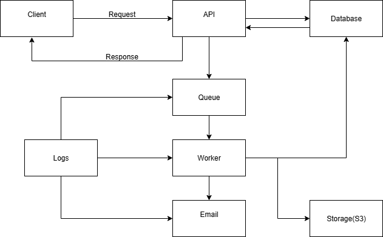

# Eversports Fullstack Interview — Backend

## Overview
This project modernizes the **Memberships** endpoints while keeping **full parity** with the legacy API, rewritten in TypeScript with automated tests. It also includes the **concept** (Task 2) for an asynchronous CSV export of memberships.

## Getting started

### Prerequisites
- Node.js 18+
- npm or yarn

### Install
```bash
npm install
# or
yarn
```

## API Routes

#### `GET /memberships`
- Lists memberships with their periods.
- **Parity note:** legacy filters periods by `membershipId` while the seed uses `membership`. This means seed items will have **empty periods** — intentionally preserved.

#### `POST /memberships`
Creates a new membership and returns the planned periods.

**Request body (JSON):**
```json
{
  "name": "Test Plan",
  "recurringPrice": 100,
  "paymentMethod": "credit card",
  "billingInterval": "monthly",
  "billingPeriods": 6,
  "validFrom": "2023-01-01"
}
```

## Tests

### Run tests
```bash
npm test
```

### Coverage
```bash
npm run test:cov
# HTML report: coverage/lcov-report/index.html
```

<h2>Architecture (CSV export)</h2>
<p align="center"></p>

### Flow (at a glance)
1. **Request** — The user triggers “Export memberships” in the app.
2. **Acknowledge** — The API records a new export job and returns **202 Accepted** with a **tracking ID** (`exportId`).
3. **Enqueue** — The job is pushed to a **message queue**.
4. **Process** — A **background worker** picks up the job and marks it **in progress**.
5. **Generate CSV** — The worker gathers the user’s memberships and writes the CSV to **file storage**.
6. **Finalize** — The worker marks the job **completed** (or **failed**) and stores the **file link**.
7. **Notify** — An email is sent to the user with the **download link**.

---

## Design decisions
- **Strict parity** with legacy (responses and error messages).
- **Separation of concerns** across controllers, services, repositories, domain, and validators.
- **Strong typing** for DTOs and domain models.
- **No real DB**: JSON-backed mock data; POST mutates in-memory arrays (like legacy). Restart server to reset.
- **Unit tests first** to ensure stability.
